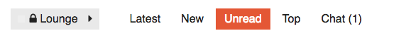
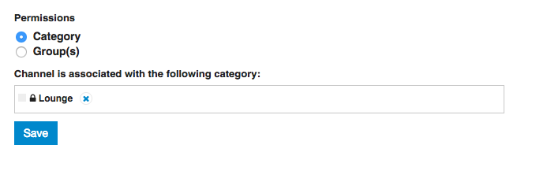
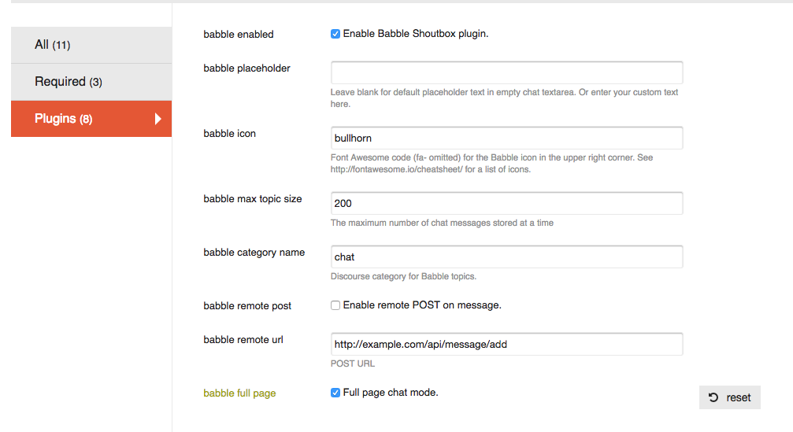

A Shoutbox style plugin for [Discourse](http://discourse.org).

[](https://codeclimate.com/github/gdpelican/babble)
[](https://gitter.im/gdpelican/babble)
[](#backers)
[](#sponsors)


#### Demo

Check out a live instance of Discourse with Babble installed on it here: [http://discourse-babble.com](http://discourse-babble.com)
(You'll have to make an account to see the chat)

#### Installation
 - Edit your web template and add the project clone url. (https://meta.discourse.org/t/install-a-plugin/19157)
 - Rebuild your web container so that the plugin installs.
 - You likely want to be on the master branch, which is the most stable:

 ```
 - git clone https://github.com/gdpelican/babble.git
 ```

However, if you want the latest cutting edge features, feel free to track the beta branch:
 ```
 - git clone -b https://github.com/gdpelican/babble.git
 ```

I'll keep the README updated with the differences between the two branches.

(Right now beta and master track the same commit)

#### Adding a chat channel

**Experimental**: Full page chat mode!
There is now a site setting for 'full page' chat mode in Babble. This will allow you to tie chat channels to a particular category, and expose a 'chat' route within your category, like so:



To do this, visit the `admin/chats` route, select 'Make a New Channel', and create a chat with 'category' permissions.


NB that you can still create group-based chats, which will appear as normal in Shoutbox mode, by selecting 'group' permissions.

To switch between 'Shoutbox' mode (with the icon in the header), and 'Full page' mode (with chats linked to a category), use the 'Use full page chat mode' plugin setting.



- Check out the [issues list](http://github.com/gdpelican/babble/issues) for a more comprehensive list of what's not working great and what could be improved.

#### Translations

Babble is currently available in English, German, French, Spanish, Italian, Finnish, Russian, Polish, and Korean.
If you'd like it translated into your language, let me know! Babble is now [on Transifex](http://transifex.com/babble/babble), which should result in a better translation experience for all.

Pull requests welcome! See [CONTRIBUTING.md](./CONTRIBUTING.md)

You can view some ongoing discussion about this plugin on [Discourse Meta](https://meta.discourse.org/t/babble-a-chat-plugin/31753)

#### Support

#### Backers
Support us with a monthly donation and help us continue our activities. [[Become a backer](https://opencollective.com/babble#backer)]


#### Sponsors
Become a sponsor and get your logo on our README on Github with a link to your site. [[Become a sponsor](https://opencollective.com/babble#sponsor)]
